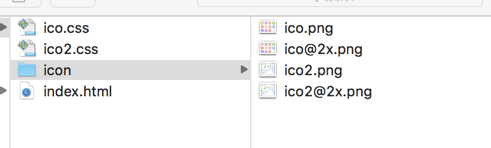
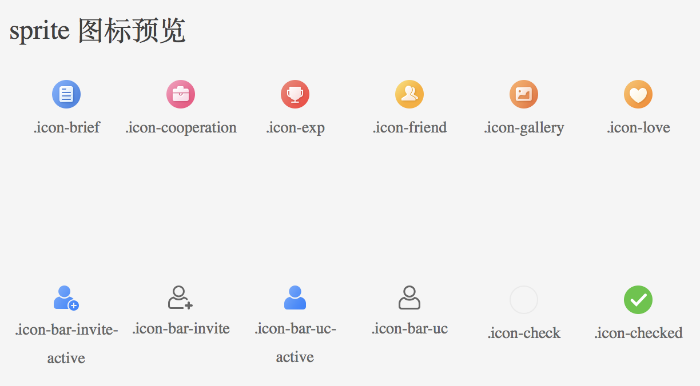

# sprite
根据小图标自动生成雪碧图，样式文件和预览html文件的小工具

>对于大小不一，颜色繁杂的小图标，为了提高前端的性能，我们一般使用图片精灵这种技术去解决。如果人为地去合成图片精灵，写css,写html。那么这个维护起来是相当繁琐，相当地耗时间的。所以这个小脚本即是为了解放人力，将人从这种繁琐中解放出来。

#### 实例预览
生成的文件预览

html预览


### 基本使用方法
#### 第一步 生成图片精灵，与css
```
gulp retina
```
图片精灵的数量按照`/src/img`下面的文件夹算，
每生成一张运行一次命令，默认是`ico`，可以加参数，例如：
```
gulp retina --module ico2
```
可以打包`src/img/ico2`下面的图片精灵为一张sprite。

*注意* 二倍图要成绝对的二倍关系，否则程序会报错

#### 第二步 注入html，生成预览页
```
npm run inject

```
*注意* 这一步会将生成的sprite css注入html，所以一定要第一步完成之后才可运行


